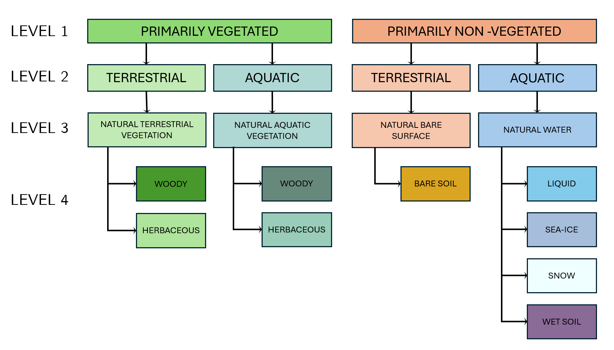

# Living Earth for Deep-Time

This repository contains all processing code and outputs created to apply the [LivingEarth](https://bitbucket.org/au-eoed/livingearth_lccs/src/main/)
framework for land cover classification into deep-time (i.e. hundreds of millions of years back in time).

## The Living Earth Framework

The Living Earth framework operationalizes Earth Observation data by translating raw imagery into standardized land cover 
classes defined by the FAO Land Cover Classification System (LCCS) or compatible national taxonomies. By converting 
complex spatial data into these consistent Environmental Descriptors, the system creates a unified language for mapping 
land and water surfaces across different regions and time periods.

This classification approach enables the systematic detection of change by comparing these standardized classes between 
distinct epochs. Rather than focusing solely on degradation, the framework identifies any transition in land cover status, 
providing a neutral, evidence-based record of how landscapes evolve in response to various driving pressures.

## Extending Land Cover Classification for Deep-Time

Applying this framework beyond the era of Earth observation requires replacing satellite-derived inputs with equivalent 
data reconstructed from palaeogeography and climate modelling. This project uses a series of palaeogeographic 
reconstructions spanning the last 545 million years (the entire Phanerozoic Eon) combined with climate variables 
(soil moisture, snow depth, forest cover, fractional vegetation, sea-ice cover) simulated by the PLASIM-GENIE model 
over the corresponding palaeogeographies, across 44 discrete time steps.

Since deep-time reconstructions have no equivalent to present-day categories such as cultivated/agricultural or 
artificial/urban surfaces, these are represented as constant, unclassified layers, and the remaining LCCS input layers 
are instead derived from custom expressions combining elevation, sea-ice cover, snow depth, soil moisture, and vegetation 
cover. This preserves the Living Earth decision-tree logic while substituting each Earth-observation input with its closest 
palaeoenvironmental analogue, producing a full Level 4 land cover classification for every reconstructed time step.



The resulting classifications make it possible to track land cover change across geological time in the same way the 
original framework tracks change between processes captured by satellite imagery, comparing successive time steps pixel by pixel (accounting 
for tectonic plate motion) and deriving geo-indicators to quantify the extent and rate of land cover transitions 
throughout the Phanerozoic.

## Repository Structure

```
LivingEarth_DeepTime/
├── analysis/                    # Scripts to analyze L4 outputs and geo_indicators
├── geo_indicators/               # Modules for calculating geographical indicators
│                                  # (adapted from florianfranz/geo_indicators)
├── inspect_outputs/              # Tools for visualizing/validating L4 outputs
│                                  # + L4 maps for selected timeslices
├── livingearth_lccs/              # Living Earth codebase — NOT in this repository
│                                  # (fork from au-eoed/livingearth_lccs)
├── preprocessing/                 # Data preparation & cleaning utilities:
│                                  #  1. centroid extraction (PLASIM-GENIE → points)
│                                  #  2. interpolation (points → GeoTIFF)
│                                  #  3. creation of LivingEarth inputs
├── rotations/                     # Pixel rotation between time steps, based on
│                                  # Euler poles for tectonic plate polygons
├── test_processing/               # Main processing folder: LE inputs, outputs
│                                  # (L3 & L4), and LE input checks
├── batch_run_lccs.py               # Main entry point — batch LCCS processing
├── config.json                     # General configuration (paths, see below)
├── LE_DT_template_to_fill.yml       # Rename to LE_DT_template.yml and edit paths
└── README.md                        # Project documentation and overview
```


The `config.json` file must contain the following elements:

```json
{
  "projet_root": "/path/to/your/project/root",
  "nc_folder_path": "/path/to/input/netcdf/files",
  "nc_to_tiff_folder_path": "/path/to/intermediate/tiff/outputs",
  "climate_output_folder": "/path/to/climate/results/final",
  "climate_output_4326_folder": "/path/to/climate/results/reprojected_4326",
  "paleo_folder": "/path/to/paleogeography/maps",
  "LE_inputs": "/path/to/living_earth/input_data",
  "LE_outputs": "/path/to/living_earth/classification_results",
  "plates_gpkg": "/path/to/rotation_poles/plates_geometry.gpkg"
}
```

| Key | Description                                                                      |
|---|----------------------------------------------------------------------------------|
| `projet_root` | Root of the project. If you fork this repository, this is `LivingEarth_DeepTime` |
| `nc_folder_path` | Path to input NetCDF files generated from the PLASIM-GENIE model                 |
| `nc_to_tiff_folder_path` | Folder with the points layer extracted from PLASIM-GENIE centroids               |
| `climate_output_folder` | Folder with GeoTIFF outputs created from centroids (ESRI:54034)                  |
| `climate_output_4326_folder` | Folder with GeoTIFF outputs created from centroids, (EPSG:4326, lat/lon)         |
| `paleo_folder` | Folder with input palaeogeographic maps                                          |
| `LE_inputs` | Folder with LivingEarth inputs                                                   |
| `LE_outputs` | Folder with LivingEarth classification results                                   |
| `plates_gpkg` | Path to the tectonic plates polygon geopackage used for rotation poles           |


## License

- **Code** in this repository is licensed under the [MIT License](LICENSE).
- **Data outputs** (palaeogeographic classifications, geo-indicators, and derived maps) are licensed under 
  [CC BY 4.0](https://creativecommons.org/licenses/by/4.0/). See [LICENSE-DATA](LICENSE-DATA)

This repository does not include or modify the Living Earth codebase (`livingearth_lccs/`, licensed under 
[Apache License 2.0](https://github.com/livingearth-lccs) by Richard Lucas and contributors). `batch_run_lccs.py` 
invokes an external, unmodified copy of this codebase as a dependency — see 
[Repository Structure](#repository-structure) for setup instructions.

